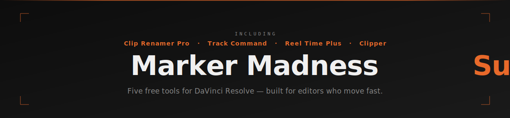

---

Five free scripting tools for DaVinci Resolve editors. No subscriptions, no nonsense, no install wizard. Drop them in your scripts folder and get to work. **Works with DaVinci Resolve 18+ — free version and Studio both fully supported.**

**[resolve-tools.com](https://resolve-tools.com)** — screenshots, guides, and downloads for every tool.

---

## The Tools

---

###  Marker Madness v1.4.5
*Because your markers deserve better than chaos.*

You dropped a hundred markers across a timeline. Some are on clips, some are on the ruler, some are named, some aren't. You need to find the red ones, rename them all, nudge them two frames earlier, export a CSV with thumbnail frames, and do it before lunch.

Marker Madness puts every marker in your timeline — clip markers and timeline markers alike — into a single, searchable, sortable table you can actually work with.

**See Everything** — Timeline markers and clip markers side by side, with timecode, color, name, note, and the clip they live on. Filter by color, filter by type, or search by name, note, or clip name. The list updates live as you type.

**Add Markers** — Place a marker on the timeline ruler, drop it automatically on the clip under your playhead (Clip Auto), or pick an exact track from a list. The Add Marker window stays visible so you can move the playhead and refresh position without losing your place.

**Edit Markers** — Double-click any marker to open a full editor: name, note, color, duration. Or right-click the Name or Note column to edit inline without opening a dialog at all.

**Batch Rename** — Add a prefix, add a suffix, find and replace text across all selected markers, copy the clip name into the marker name, or copy the name into the note. Preview every change before committing. Undo with one click if you change your mind.

**Change Colors** — Select any number of markers and right-click the Color column to recolor them all at once.

**Nudge** — Shift selected markers forward or backward by any number of frames. Handles timeline markers and clip markers. Undoable.

**Promote & Demote** — Copy or move clip markers up to the timeline ruler. Copy or move timeline markers down onto a clip. Pick a frame offset and optionally change the color on the way.

**Copy and Paste Across Timelines — and Projects** — Select any markers, hit Copy Markers, switch to a different timeline, position your playhead, and hit Paste Markers. The earliest copied marker aligns to the playhead, all others follow at the same offsets. A dialog lets you choose where to land: the Timeline Ruler, or any video/audio track that has a clip at the paste position. The clipboard lives in memory for as long as Marker Madness stays open — so you can paste across timelines, across tracks, or even across entirely different PROJECTS. Switch projects in Resolve, bring Marker Madness back to the foreground, and paste. No CSV export, no round-trips.

**Jump to Any Marker** — Select a marker and move Resolve's playhead directly to it. Toggle auto-jump to have the playhead follow your selection automatically.

**Grab Frames** — See a live preview thumbnail for any marker and export it as a PNG named with the marker's timecode and label.

**Batch Export Frames** — Export a still frame for every marker — or just the selected ones — in one shot. Files are named with index, type, timecode, and marker name.

**Export to CSV** — Export your marker list as a CSV, with optional thumbnails and an auto-generated HTML report you can open in any browser. Import a CSV back to recreate markers from a spreadsheet. The export follows your current column order.

**Marker Exchange** — Exchange markers directly with Adobe Premiere Pro and Avid Media Composer. Export Resolve timeline markers as a Premiere-readable CSV or an Avid Media Composer locator file. Import back from either — markers land on the timeline ruler with Avid locator colors mapped automatically to the nearest Resolve color. An optional TC Offset field handles timelines with different start timecodes.

**Shot Change Report** — The VFX workflow feature. Export a Marker Madness CSV before the editor makes cuts, then export another after. Load both into the Shot Change Report window and get an instant diff: shots that changed duration, shots that were dropped, new shots that didn't exist before, and unchanged shots. Export as CSV or a printable HTML report with optional thumbnail frames.

**Drag to Reorder Columns** — Drag any column heading left or right. The new order sticks between sessions and carries through to CSV exports.

**Undo** — Most operations push onto an undo stack. One button rolls back the last action.

**Floating Above Resolve** — The *Float above Resolve* option keeps the window on top when Resolve is your frontmost app and steps aside when you switch to something else.

---

###  Clip Renamer Pro v2.0
*Batch rename without the batch headache.*

You've got 200 clips in a bin that all came off camera named something like `A001C002_240318_R3D2`. You need them to say something a human can read. Or you've got a mix of cases and want everything sentence-case. Or you're adding a project code prefix to every clip before you hand off the drive.

Clip Renamer Pro handles all of it — with a live before/after preview so you can see every change before it happens.

**Find & Replace** — Simple text replacement across every selected clip name at once.

**Prefix & Suffix** — Add text to the beginning or end of every name in one pass.

**Counter** — Insert an auto-incrementing number anywhere in the name: before, after, or embedded in a find/replace pattern.

**Case Conversion** — Uppercase, lowercase, title case, or sentence case. Fix whatever the camera operator did.

**Trim** — Strip leading and trailing whitespace, or remove a set number of characters from either end.

**Live Preview** — The before column shows what you've got. The after column shows exactly what you'll get. Nothing changes until you hit Apply.

Works on Media Pool clips, timelines, or both. Select what you want to rename, configure the transform, preview, apply.

---

###  Track Command v1.1
*Your timeline's track names, finally under control.*

A 65-track timeline where half the audio tracks are still named "Audio 1" through "Audio 65" is nobody's friend — not in exports, not in delivery, not when a client asks where the music stem is.

Track Command puts every audio and video track from your current timeline into an editable list. Rename one, rename all, do it fast.

**Batch Rename** — The same rename engine from Clip Renamer Pro: prefix, suffix, find and replace, counter, case conversion. Select any tracks and rename them in one pass with a live preview.

**Add Tracks** — Add audio tracks (mono, stereo, adaptive, etc.) or video tracks without leaving the tool. Specify how many and what type.

**Delete Tracks** — Select tracks and delete them directly from the list.

**Search** — Filter the track list by name to find what you're looking for in a dense timeline.

**Save & Load Templates** — Save your current track name set as a reusable template. Load it later to recreate your standard track layout on any timeline.

---

###  Reel Time Plus v1.2
*Running time, always in frame.*

You're cutting a four-act TV movie to a 1:26:30 delivery spec and you're six minutes over. You need to know which act is carrying the weight — and exactly how much you need to lose. Or you're in DI and need to confirm your total runtime including leaders clears the delivery window before you send the drive.

Reel Time Plus is a running-time calculator for TV and film editors. Create named show projects, add acts or reels with durations, set a goal time, and see your total runtime — with a live over/under readout and a proportional segment bar — updated the moment you change anything.

**Projects** — Keep as many shows as you like, each with its own name, frame rate, and segment structure.

**Acts & Reels** — Add segments with individual durations. A proportional bar shows each segment's share of the whole at a glance.

**Goal & Over/Under** — Set a target runtime. The header tells you exactly how far over or under you are, live as you edit.

**TV Breaks** — Specify a commercial break duration and Reel Time Plus automatically adds N−1 breaks between your acts. Four acts = three breaks.

**Film Leader** — Add head and tail leader in two modes: *Whole Show* (one head and one tail for the full deliverable) or *Per Segment* (leader on every individual reel, for DI delivery).

**Film Format** — Set each project to Digital, 35mm (16 frames/foot), or 16mm (40 frames/foot). Switch the entire segment list between Timecode, Feet+Frames, and Frames view with one click. Right-click any segment's timecode to spot-check that row in feet+frames without changing the rest.

**Flexible Input** — Enter segment durations as timecode (H:MM:SS:FF or H:MM:SS.FF), feet+frames (e.g. `1234+08`), or bare frame counts. Toggle the input format per segment in the edit dialog.

**FPS Aware** — 11 frame rates: 23.98 NDF, 24, 25, 29.97 DF, 29.97 NDF, 30, 48, 50, 59.94 DF, 59.94 NDF, 60. FPS is locked after project creation to keep all frame counts consistent.

**Open to Projects** — Set the app to always open on the projects list rather than the last project you had open.

**Fully Standalone** — Reel Time Plus runs as a native app on macOS (Intel + Apple Silicon) and Windows with no DaVinci Resolve connection required, no Python install, nothing to configure. Also available as a `.py` script for the Resolve scripts menu.

###  Clipper v1.2
*One click. Every clip. Done.*

You've got a finished cut on V1 — or a selects reel on V2 — and you want every clip turned into a subclip and organized into a Media Pool bin. You could right-click each one, fill in the in/out points, name it, choose the bin... forty times. Or you could open Clipper, pick the track, pick the bin, and hit Create.

Clipper reads every clip on the chosen track, calculates the exact source in/out points from the timeline, and drops a named subclip for each clip into whichever Media Pool bin you point it at — or a new one you create on the spot.

**Track Selector** — Choose any video or audio track by label — or pick **All Tracks** to capture every clip across the entire timeline in one pass. The clip count is shown before you commit.

**Destination Bin** — Pick any existing Media Pool bin from a full folder-tree dropdown, or hit + New Bin to create one without leaving the tool.

**Prefix & Suffix** — Add text to the front or back of every subclip name in one pass. The live preview updates as you type.

**Handles** — Add head and tail frames to every clip for VFX pulls. Shared or custom per side.

**In/Out Range** — Limit clip creation to only the clips that fall within the timeline's In/Out marks.

**Clip from Range** — Set an In and Out mark on the timeline, pick a track (or All Tracks), and Clipper assembles all the clips in that range into one new timeline sequence in your chosen bin. Optionally preserves clip markers.

**Live Preview** — See the exact subclip name, source clip, source In TC, source Out TC, and duration for every clip on the track before creating anything. Clips that can't become subclips (generators, titles, compounds) are flagged in amber and skipped gracefully.

**Auto-Disambiguate** — If two clips share a source name, they become `ClipName_01` and `ClipName_02` automatically. No collisions, no overwritten subclips.

**Preserve Timeline Order** — Prepend a sort prefix so clips land in cut order in the bin regardless of source name. Two modes: **Sequential** (T01_, T02_…) or **Timecode** (01-00-44-05_…) for reliable sorting even across multiple separate runs. When All Tracks is selected, a track prefix is added automatically (V2_T03_, A1_01-00-44-05_, etc.).

**Preserve Clip Markers** — Markers on original timeline clips are copied to the new subclips or sequence clips, with offsets adjusted for any head handles added.

**Video Only** — Strip all audio tracks from created sequences when you only need the picture.

**Abort** — Stop a running batch mid-way with one click. Clips already created are kept; the summary shows exactly what was processed and how many were not reached.

**Results Summary** — After each run: how many were created, how many skipped, how many failed — with a list of any failures.

> **Note:** Clipper is not the subclip tool from Avid Media Composer. The DaVinci Resolve scripting API does not support creating a single subclip that spans multiple source clips. Clipper creates one true subclip per clip on the selected track.
>
> **Want true standalone clips from a range?** Use *Clip from Range* to build a sequence, then open that sequence, lasso all the clips, and drag them directly into any Media Pool bin. Resolve converts each dragged clip into its own clip entry. A few extra steps, but it gets you there.

---

## Installation

### Reel Time Plus — Standalone App (Recommended)
Download the `.app` (macOS) or `.exe` (Windows) from [resolve-tools.com](https://resolve-tools.com/reel-time-plus.html) or the [Releases](https://github.com/h9d6hrbzyn-debug/Marker-Madness-Suite-for-Davinci-Resolve/releases) page. Double-click and go — no Python, no Resolve, no configuration.

- **macOS:** Universal binary — runs natively on Intel and Apple Silicon.
- **Windows:** Single `.exe` — no install wizard, no dependencies.

### All Tools — Resolve Scripts (`.py`)
1. Download the `.py` files from this repo (or the full suite zip from [resolve-tools.com](https://resolve-tools.com))
2. Copy them to your DaVinci Resolve scripts folder:
   - **macOS:** `/Library/Application Support/Blackmagic Design/DaVinci Resolve/Fusion/Scripts/Utility/`
   - **Windows:** `C:\ProgramData\Blackmagic Design\DaVinci Resolve\Support\Developer\Scripting\Scripts\Utility\`
3. Launch DaVinci Resolve
4. Run any tool from **Workspace → Scripts → Utility**

**Requirements:** DaVinci Resolve 18+ (free version and Studio both fully supported) and **Python 3** — Resolve only runs `.py` scripts if Python 3 is installed on your machine. Download the free installer from [python.org/downloads](https://www.python.org/downloads/), or if you'd rather get it through Resolve directly, open the Resolve console (**Workspace → Console**) — when Python isn't detected, Resolve shows a link to the same Python 3 download. No external Python packages needed beyond that — the tools use only what ships with Python.

---

## Notes

- Marker Madness works with both timeline markers and clip markers
- Grab Frame and Batch Export require the Edit or Color page to be active in Resolve
- The Undo stack clears when you Refresh
- Preferences (column order, sort, window size, toggle states) are saved automatically to `prefs.json` alongside the script
- Clip markers on text layers and Fusion compositions may not support all operations
- Reel Time Plus FPS is locked after project creation — wrong FPS? Start a new project

---

*Free to use and share. Built with love for editors.*
